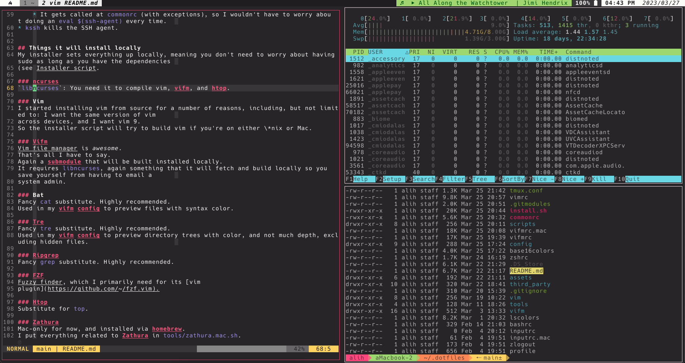
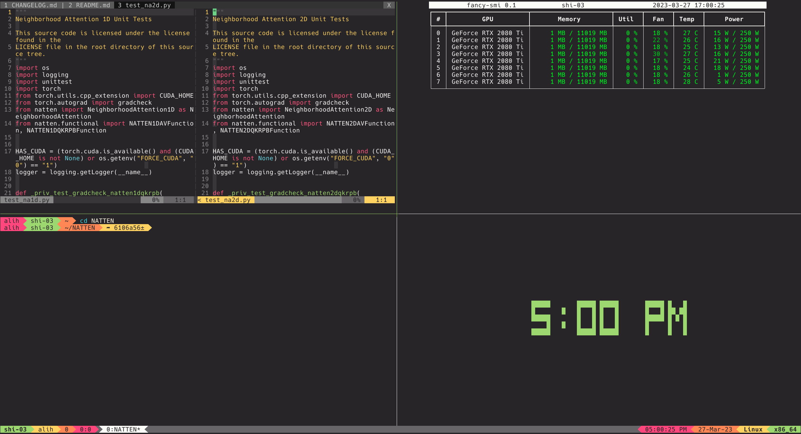
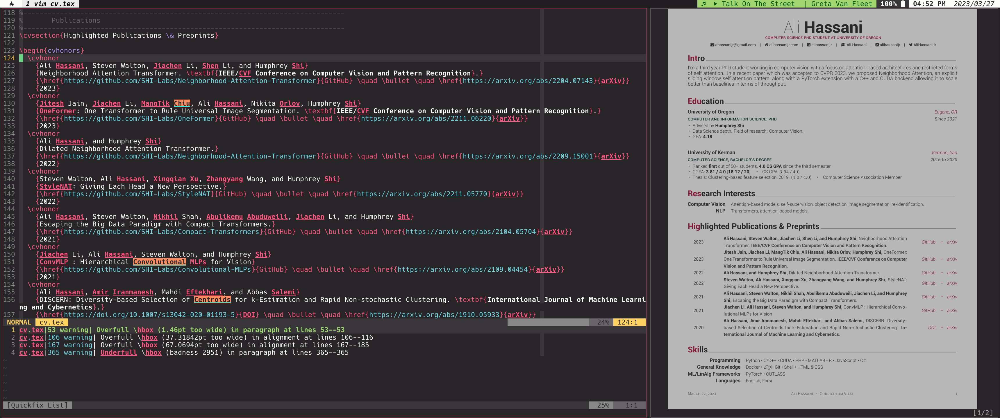
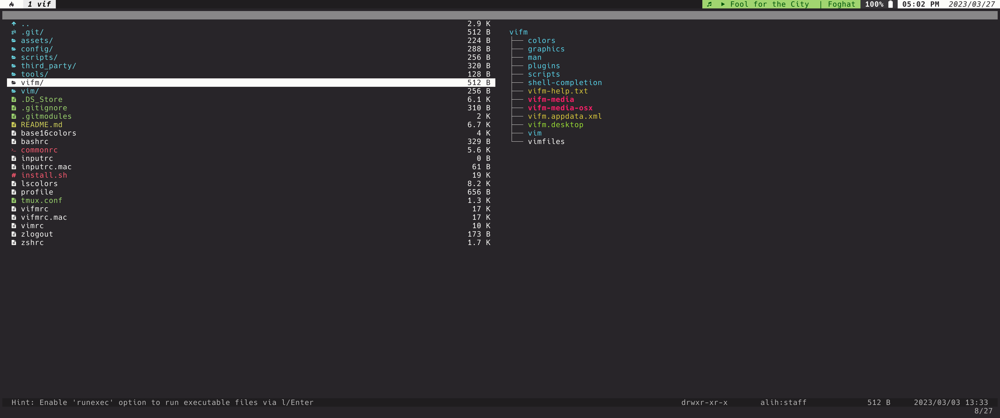
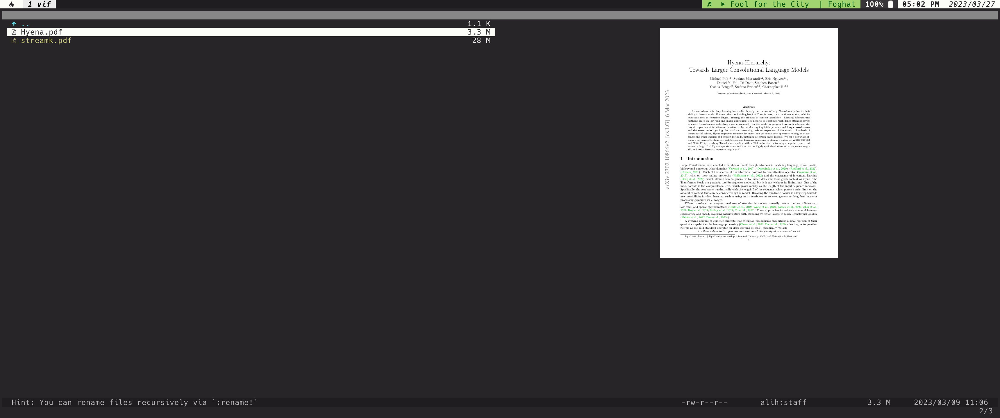
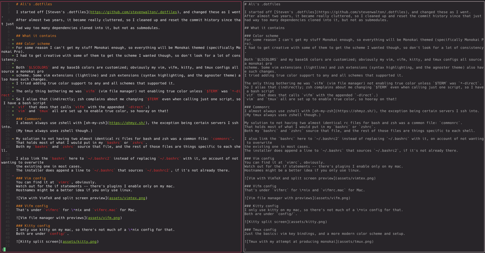
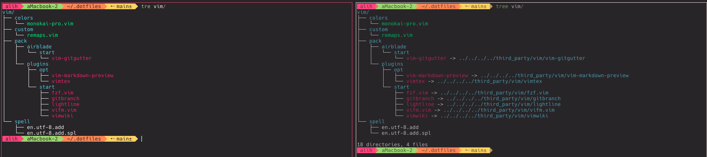
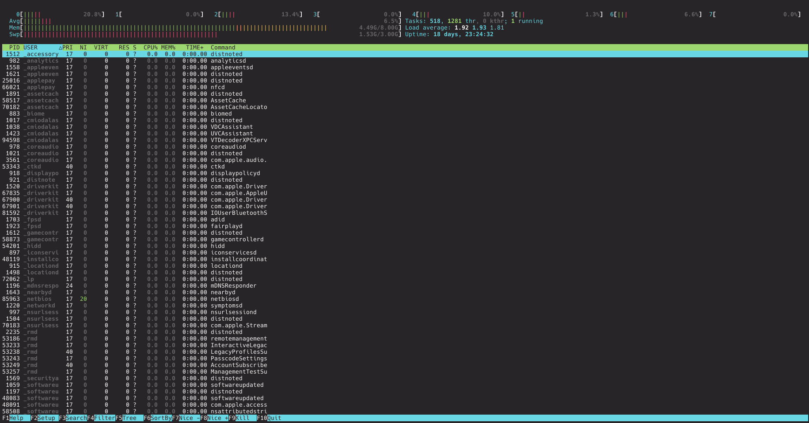
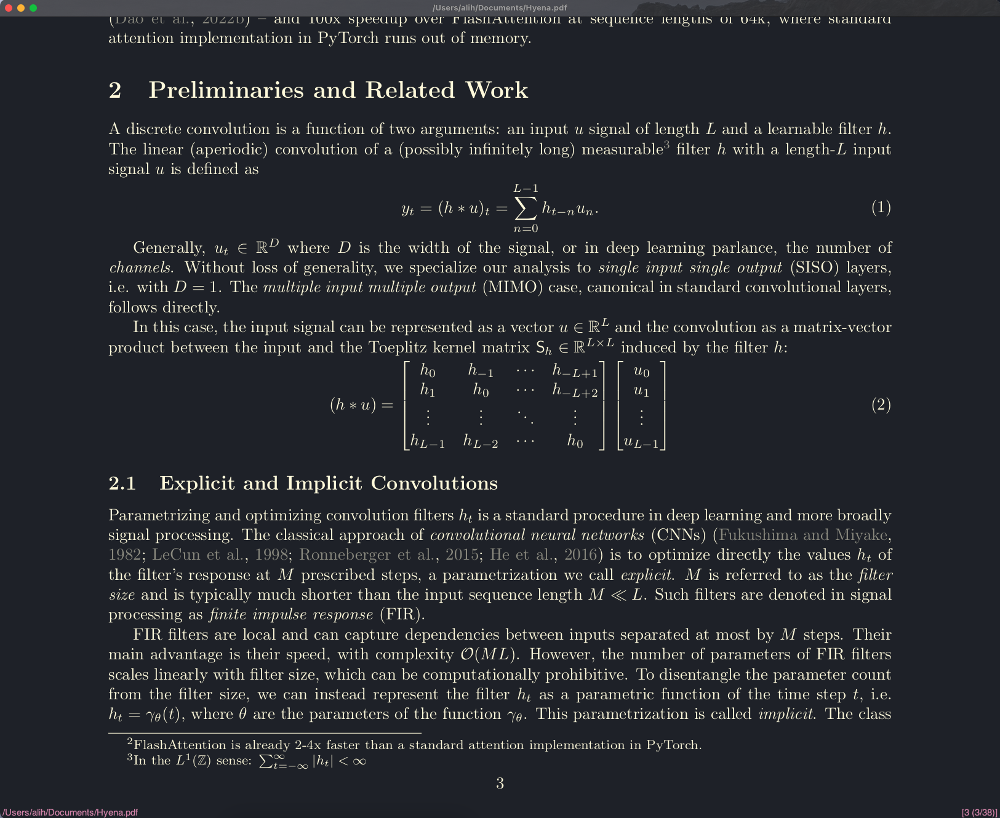

# Ali's .dotfiles

I started off [Steven's .dotfiles](https://github.com/stevenwalton/.dotfiles), and changed these as I went.
After almost two years, it became really cluttered, so I cleaned up and reset the commit history since that just
had way too many dependencies cloned into it, but not as submodules.

## What it contains

### Color scheme
For some reason I can't get my stuff Monokai enough, so everything will be Monokai themed (specifically Monokai Pro).
I had to get creative with some of them to get the scheme I wanted though, so don't look for a lot of consistency.

Both `$LSCOLORS` and my base16 colors are customized; obviously my vim, vifm, kitty, and tmux configs all source a monokai pro
scheme. Some vim extensions (lightline) and zsh extensions (syntax highlighting, and the agnoster theme) also have such changes.
I tried adding true color support to any and all schemes that supported it.

The only thing bothering me was `vifm` (vim file manager) not enabling true color unless `$TERM` was `*-direct`.
So I alias that (indirectly; zsh complains about me changing `$TERM` even when calling just one script, so I have a bash script
`vif` that does that calls `vifm` with the appended `-direct`.)
`vim` and `tmux` all are set up to enable true color, so hooray on that!

### Commonrc
I almost always use zshell with [oh-my-zsh](https://ohmyz.sh/), the exception being certain servers I ssh into.
(My tmux always uses zshell though.)

My solution to not having two almost identical rc files for bash and zsh was a common file: `commonrc`.
That holds most of what I would put in my `bashrc` or `zshrc`.
Both my `bashrc` and `zshrc` source that file, and the rest of those files are things specific to each shell.

I also link the `bashrc` here to `~/.bashrc2` instead of replacing `~/.bashrc` with it, on account of not wanting to overwrite
the existing one in most cases.
The installer does append a line to `~/.bashrc` that sources `~/.bashrc2`, if it's not already there.

### Vim config
You can find it at `vimrc`, obviously.
Watch out for the if statements -- there's plugins I enable only on my mac.
Hostnames might be a better idea if you only use linux.

### Vifm config
That's under `vifmrc` for linux and `vifmrc.mac` for Mac.

### Kitty config
I only use kitty on my mac, so there's not much of a linux config for that.
Both are under `config/`.



### Tmux config
Just the basics: vim key bindings, and a more modern color scheme and setup.



### Zathura config
My go-to PDF viewer, especially if I'm writing TeX, because it's awesome and has vim key bindings.
(Alias: `zat $FILENAME`)
What I wish I could figure out is a way to get it running in-terminal instead of the GTK gui window, 
but I'm guessing it's a long shot on mac.

That's why by default, VimTex opens a kitty window split and calls a python-based PDF preview script with vim key bindings.
It is useful  sometimes -- but if I ever need to dig in, zoom in, forward search, stuff like that, I get Zathura back by just 
doing `<leader>lv`.


### Custom scripts
These are under [scripts/](scripts/), but the installer links them to `~/.local/bin`.

* `cnda` looks for a local anaconda3 directory, and loads and initializes it if it finds one.
    * It's especially helpful because there's plenty of scenarios where I have conda installed, but I only want to load it under special circumstances.
    * It also eliminates the heartache with adding conda init to bashrc.
    * NOTE: to use it, you need to source it: `source cnda`.
* `sagent` looks for an SSH agent process, and sets one up if it doesn't find any.
    * I really needed this when I started using tmux. I'd have a bajillion panes and splits, each with their own shell, and each with its own ssh agent spawned. It was just too crazy to deal with, so this is my temp solution that's lasted for about two years.
    * It gets called at `commonrc` (with exceptions), so I wouldn't have to worry about doing an `eval $(ssh-agent)` every time.
* `kssh` kills the SSH agent.


## Things it will install locally
My installer sets everything up locally, meaning you don't need to worry about having sudo as long as you have the dependencies
(see [Installer script](#installer-script).

### ncurses
`libncurses`: You need it to compile vim, vifm, and htop.

### Vim
I started installing vim from source for a number of reasons, including, but not limited to: I want the same version of vim 
across devices, and I want vim 9.
So the installer script will try to build vim if you're on either linux or mac.



### Vifm
[Vim file manager](https://github.com/vifm/vifm) is *awesome*.
That's all I have to say.
Again a submodule that will be built installed locally.
It requires `libncurses`, again something that it will fetch and build locally so you save yourself from having to email a
system admin.






### Bat
Fancy `cat` substitute. Highly recommended.
Used in my vifm config to preview files with syntax color.




### Tre
`tree` substitute.
Used in my vifm config to preview directory trees, and not much depth, excluding hidden files.
It's just easier to work with in some cases compared to `tree`.
We get the monokai colors either way because we're modifying `$LSCOLORS`.



### Ripgrep
Fancy `grep` substitute. Highly recommended.

### FZF
[Fuzzy finder](https://github.com/junegunn/fzf), which I primarily need for its [vim
plugin](https://github.com/junegunn/fzf.vim).

### Htop
Substitute for `top`.



### Zathura
Mac-only for now, and installed via homebrew.
I put everything related to Zathura in `tools/zathura.mac.sh`.




## Requirements

### Linux
Everything is built from source, so no need to email a sys admin to ask them to install your preferred version of things.
Of course, you need the basics: make, cmake, autoconf, automake, autotools.

### Mac
(Almost) everything is built from source.
Of course, you need the basics: make, cmake, autoconf, automake, autotools.
Some things are installed with homebrew, on account of them just being easier to set up.
Specifically, [Zathura](https://pwmt.org/projects/zathura/) is installed via homebrew on account of it having a bunch of 
dependencies, plus DBUS in order to interact with [VimTeX](https://github.com/lervag/vimtex).
You also need Xcode and CommandLineTools on Mac.

## Installer script
WARNING: If you're not Ali, read the script before running it.
I left as many comments as I could.

To install dependencies and link config files, run:
```
./install.sh
```
This will pull all submodules, install packages that it doesn't find locally, and symlink all the config files.

## Plugins
### Oh My ZSH
* `history-substring-search`
* `colored-man-pages`
* `zsh-autosuggestions`
* `zsh-syntax-highlighting`

#### Mac only
* `macos`
    * I forget why this was required on mac.

### Vim
I just use the vim plugin manager.

#### Auto start
* [vifm.vim](https://github.com/vifm/vifm.vim)
* [vim-gitgutter](https://github.com/airblade/vim-gitgutter)
* [fzf.vim]()https://github.com/junegunn/fzf.vim]
* [lightline](https://github.com/itchyny/lightline.vim)
    * [gitbranch](https://github.com/itchyny/vim-gitbranch)
* [vimwiki](https://github.com/vimwiki/vimwiki).


#### Mac only
Plugins I only use on my personal device, because of both dependencies and usage.
* [VimTex](https://github.com/lervag/vimtex)
    * You need to install a LaTeX engine locally (i.e. `latexmk`)
    * I also use [termpdf](https://github.com/dsanson/termpdf.py) ([my fork](https://github.com/alihassanijr/termpdf.py)) to
      preview latex pdf outputs. I managed to get VimTeX to call Kitty's remote control commands and have it split screen and
      view the pdf. You can toggle it with `<leader>lp`, and you can still get Zathura to open with `<leader>lv`.
* [vim-markdown-preview](https://github.com/iamcco/markdown-preview.nvim)
